# Go Struct Auto Fill

[](LICENSE)
[](https://github.com/leeprince/go-struct-auto-fill/releases)
[](https://github.com/leeprince/go-struct-auto-fill/actions)
[](https://marketplace.visualstudio.com/items?itemName=leeprince.go-struct-auto-fill)
[](https://marketplace.visualstudio.com/items?itemName=leeprince.go-struct-auto-fill)

[中文版](./README.md)

## Introduction

Go Struct Auto Fill is a Visual Studio Code extension for automatically filling Go struct fields. It helps developers generate and fill all uninitialized fields when initializing structs, reducing manual input workload.


## Features

- **Auto-fill struct fields**: Automatically generate and fill uninitialized fields according to struct definitions.
- **Smart cursor positioning**: Trigger auto-fill at **any position inside struct braces**, no need to be on a specific line.
- **Nested struct support**: Correctly handle and fill nested struct fields.
- **Multi-scenario support**: Supports arrays, maps, append functions, function parameters, and more Go struct initialization scenarios.
- **Smart field checking**: Ensures only fields within the current struct are checked, avoiding cross-struct errors.
- **Detailed logging**: Provides detailed log information to help developers diagnose issues.
- **No temp files ✨**: **Never creates any temp files**, directly uses completion info from the current document, keeping your workspace clean.
- **Package struct support**: Perfectly supports package-style structs (e.g. `user.User`, `pb.Message`).
- **Strict field order**: Fills and reorders all fields strictly according to struct definition order.

> The role of structs: **Data encapsulation for complex models**, **method binding**, **JSON serialization/deserialization**, **improving code reuse and modularity**, etc.

## Installation

### From Marketplace (Recommended)

1. Open Visual Studio Code.
2. Go to the Extensions panel (Ctrl+Shift+X).
3. Search for `Go Struct Auto Fill` and click Install.

### Build from Source

1. **Clone the project**:

```bash
git clone https://github.com/leeprince/go-struct-auto-fill.git
cd go-struct-auto-fill
```

#### Method 1: Use Makefile (One-click build)

```bash
# One-click build extension package
make build

# Or build and install directly to VSCode
make install-extension

# View all available commands
make help
```

#### Method 2: Manual build

2. **Install dependencies**:

```bash
npm install
```

3. **Compile the extension**:

```bash
npm run compile
```

4. **Package the extension**:

```bash
vsce package
```

> To publish to the VSCode Marketplace.
> Reference: <https://code.visualstudio.com/api/working-with-extensions/publishing-extension#publishing-extensions>
> Authentication requires <publisher id>
>
> ```bash
> vsce login <publisher id>
>    ```
>
> Publish command
>
> ```bash
> vsce publish
>    ```
>
> If publishing fails, you can also **upload manually**. See the official documentation for details.

5. **Install the extension**:
   - Open Visual Studio Code.
   - Go to the Extensions panel (Ctrl+Shift+X).
   - Click the `...` button in the top right, select `Install from VSIX...`.
   - Select the generated `.vsix` file to install.

## Usage

1. Open a Go file.
2. Place the cursor **anywhere inside the struct initialization braces `{}`**.
3. Trigger the auto-fill command:
   - Use the shortcut (default: `Alt+Enter`, supports Mac/Windows/Linux).
   - Or search and select `Go Struct Auto Fill: Fill Struct Fields` in the command palette (Ctrl+Shift+P).

### Usage Example

```go
package main

type User struct {
    Name    string `json:"name,omitempty"`
    Age     int    `json:"age,omitempty"`
    Email   string `json:"email,omitempty"`
    Active  bool   `json:"active,omitempty"`
}

func main() {
    // 1. Normal initialization - place cursor inside {}, press Alt+Enter
    user := User{ // ✅ here is fine
        // ✅ here is also fine
    }
    
    // 2. Array initialization - place cursor inside User{} braces, press Alt+Enter  
    users := []User{
        User{ // ✅ here is fine
            // ✅ here is also fine
        },
    }
    
    // 3. Map initialization - place cursor inside User{} braces, press Alt+Enter
    userMap := map[string]User{
        "admin": User{ // ✅ here is fine
            // ✅ here is also fine
        },
    }
    
    // 4. Nested struct - smartly recognizes the struct level of the current cursor
    complexUser := User{ // ✅ fill User fields here
        // ✅ fill User fields here
        Profile: Profile{ // ✅ fill Profile fields here
            // ✅ fill Profile fields here
        },
        // ✅ continue filling User fields here
    }
}
```

Auto-filled result:

```go
user := User{
    Name:   "",
    Age:    0,
    Email:  "",
    Active: false,
}
```

## Supported Scenarios

### ✅ Supported struct initialization scenarios

#### 1. Normal variable initialization

```go
// Normal struct
 d := ddd{
     // Place the cursor anywhere inside the struct braces and press Alt+Enter to auto-fill
 }

// Pointer struct
 d2 := &ddd{
     // Place the cursor anywhere inside the struct braces and press Alt+Enter to auto-fill
 }

// var declaration
 var d3 = ddd{
     // Place the cursor anywhere inside the struct braces and press Alt+Enter to auto-fill
 }
```

#### 2. Package struct initialization 🆕

```go
// Package struct (e.g. protobuf, structs from other packages)
userInfo := &user.User{
    Name:  "Zhang San",
    Email: "zhangsan@example.com",
    // Place the cursor here and press Alt+Enter to auto-fill remaining fields
}

// After auto-fill (strictly following struct definition order)
userInfo := &user.User{
    Id:       0,                    // New field
    Name:     "Zhang San",         // Keep original value
    Email:    "zhangsan@example.com", // Keep original value
    IsActive: 0,                    // New field
}
```

#### 3. Nested struct

```go
d1 := ddd1{
    ID:  "",
    Age: 0,
    ddd2: &ddd2{
        // Place the cursor anywhere inside the struct braces and press Alt+Enter to auto-fill nested struct
    },
}

// Linked list struct
ln := ListNode{
    Val: 0,
    Next: &ListNode{
        // Place the cursor anywhere inside the struct braces and press Alt+Enter to auto-fill
    },
}
```

#### 4. Array initialization 🆕

```go
// Array literal
dList := []ddd{
    ddd{}, // Place the cursor anywhere inside the struct braces and press Alt+Enter to auto-fill
}

// Multiple array elements
dList2 := []ddd{
    ddd{
        Name: "first",
    },
    ddd{}, // Place the cursor anywhere inside the struct braces and press Alt+Enter to auto-fill
}
```

#### 5. Map initialization 🆕

```go
// Simple map
dMap := map[string]ddd{
    "name": ddd{}, // Place the cursor anywhere inside the struct braces and press Alt+Enter to auto-fill
}

// Complex map
complexMap := map[string][]ddd{
    "items": []ddd{
        ddd{}, // Place the cursor anywhere inside the struct braces and press Alt+Enter to auto-fill
    },
}
```

#### 6. append function 🆕

```go
var dSlice []ddd
dSlice = append(dSlice, ddd{}) // Place the cursor anywhere inside the struct braces and press Alt+Enter to auto-fill
```

#### 7. Function parameter 🆕

```go
// Function call parameter
processStruct(ddd{
    // Place the cursor anywhere inside the struct braces and press Alt+Enter to auto-fill
})
```

## Technical Architecture Diagram

### flow chart

```mermaid
 flowchart TD
    A["VSCode 编辑器"] -->|"用户触发插件快捷键 Alt+Enter 或命令行触发"| B["Go Struct Auto Fill 插件"]
    B --> C["定位光标位置"]
    C --> D["分析结构体上下文"]
    D --> E["查找结构体声明"]
    E --> F["获取补全项vscode.executeCompletionItemProvider"]
    F --> G["解析已有字段"]
    F --> H["获取结构体字段顺序"]
    G --> I["生成有序字段代码"]
    H --> I
    I --> J["计算结构体内容范围"]
    J --> K["替换或插入字段到文档"]
    K --> L["格式化与缩进代码"]
    L --> M["信息/日志/通知输出"]
    %% 核心逻辑高亮
    classDef core fill:#bfb,stroke:#333,stroke-width:2px;
    class F,G,H,I,J,K,L core;
```



> All completion, sorting, content generation, insertion, and formatting are performed directly in the current document, with absolutely no temp files created.

## todo

- **Smart indentation**: Automatically adjusts code indentation for different initialization scenarios.

## Feedback & Contribution

If you encounter any issues or have suggestions for improvement, feel free to submit an issue on [GitHub Issues](https://github.com/leeprince/go-struct-auto-fill.git).

If you are interested in contributing code, please fork the repository and submit a Pull Request.

You can also contact me via the WeChat public account "皇子谈技术" (Prince Talks Tech).

## License

This project is licensed under the MIT License - see the [LICENSE](LICENSE) file for details.
