# Go Struct Auto Fill

[](LICENSE)
[](https://github.com/leeprince/go-struct-auto-fill/releases)
[](https://github.com/leeprince/go-struct-auto-fill/actions)
[](https://marketplace.visualstudio.com/items?itemName=leeprince.go-struct-auto-fill)
[](https://marketplace.visualstudio.com/items?itemName=leeprince.go-struct-auto-fill)
<!-- [](https://github.com/leeprince) -->
<!-- [](https://github.com/leeprince/go-struct-auto-fill/issues) -->
<!-- [](https://github.com/leeprince/go-struct-auto-fill/stargazers) -->

[English Version](./README.en.md)

## 简介

Go Struct Auto Fill 是一个 Visual Studio Code 插件，用于自动填充 Go 语言结构体的字段。它可以帮助开发者在初始化结构体时，自动生成并填充所有未初始化的字段，减少手动输入的工作量。


## 功能

- **自动填充结构体字段**：根据结构体定义，自动生成并填充未初始化的字段。
- **智能光标定位**：支持在结构体大括号内**任何位置**触发自动填充，无需精确定位到特定行。
- **支持嵌套结构体**：能够正确处理嵌套结构体，并填充其字段。
- **多场景支持**：支持数组、map、append函数、函数参数等多种Go结构体初始化场景。
- **智能字段检查**：确保只在当前结构体的范围内检查字段是否已存在，避免跨结构体的错误判断。
- **智能缩进**：根据不同的初始化场景自动调整代码缩进格式。
- **详细的日志输出**：提供详细的日志信息，帮助开发者诊断问题。
- **无临时文件** ✨：**完全不创建任何临时文件**，直接在当前文档中获取补全信息，保持工作区清洁。
- **包名结构体支持**：完美支持包名形式的结构体（如 `user.User`、`pb.Message` 等）。
- **字段顺序严格按定义排列**：严格按照结构体定义顺序填充和重排所有字段。

> 结构体的作用：**数据封装构建复杂数据模型**、**方法绑定**、**JSON 序列化/反序列化**、**提高代码复用性和模块化**等

## 安装

### 从 Marketplace 安装【推荐】

1. 打开 Visual Studio Code。
2. 进入扩展面板（Ctrl+Shift+X）。
3. 搜索 `Go Struct Auto Fill` 并点击安装。

### 从源码构建

1. **克隆项目**：

```bash
git clone https://github.com/leeprince/go-struct-auto-fill.git
cd go-struct-auto-fill
```

#### 方法一：使用Makefile（一键构建）

```bash
# 一键构建插件包
make build

# 或者构建并直接安装到VSCode
make install-extension

# 查看所有可用命令
make help
```

#### 方法二：手动构建

2. **安装依赖**：

```bash
npm install
```

3. **编译插件**：

```bash
npm run compile
```

4. **打包插件**：

```bash
vsce package
```

> 发布到 vscode 的 Marketplace.
> 参考：<https://code.visualstudio.com/api/working-with-extensions/>    publishing-extension#publishing-extensions>
> 认证需要<publisher id>
>
> ```bash
> vsce login <publisher id>
> ```
>
> 命令发布
>
> ```bash
> vsce publish
> ```
>
> 如果命令发布失败，还可以通过**手动上传**，详情参考官方文档。

5. **安装插件**：
   - 打开 Visual Studio Code。
   - 进入扩展面板（Ctrl+Shift+X）。
   - 点击右上角的 `...` 按钮，选择 `从 VSIX 安装...`。
   - 选择生成的 `.vsix` 文件进行安装。

## 使用

1. 打开一个 Go 文件。
2. 将光标放在结构体初始化的大括号 `{` 内的**任何位置**。
3. 触发自动填充命令：
   - 使用快捷键（默认：`Alt+Enter`，支持Mac/Windows/Linux）。
   - 或者在命令面板（Ctrl+Shift+P）中搜索并选择 `Go Struct Auto Fill: Fill Struct Fields`。

### 使用示例

```go
package main

type User struct {
    Name    string `json:"name,omitempty"`
    Age     int    `json:"age,omitempty"`
    Email   string `json:"email,omitempty"`
    Active  bool   `json:"active,omitempty"`
}

func main() {
    // 1. 普通初始化 - 将光标放在 {} 内任何位置，按 Alt+Enter
    user := User{ // ✅ 这里可以
        // ✅ 这里也可以
    }
    
    // 2. 数组初始化 - 将光标放在 User{} 的 {} 内任何位置，按 Alt+Enter  
    users := []User{
        User{ // ✅ 这里可以
            // ✅ 这里也可以
        },
    }
    
    // 3. Map初始化 - 将光标放在 User{} 的 {} 内任何位置，按 Alt+Enter
    userMap := map[string]User{
        "admin": User{ // ✅ 这里可以
            // ✅ 这里也可以
        },
    }
    
    // 4. 嵌套结构体 - 智能识别当前光标所在的结构体层级
    complexUser := User{ // ✅ 光标在这里填充 User 的字段
        // ✅ 光标在这里也填充 User 的字段
        Profile: Profile{ // ✅ 光标在这里填充 Profile 的字段
            // ✅ 光标在这里也填充 Profile 的字段
        },
        // ✅ 光标在这里继续填充 User 的字段
    }
}
```

自动填充后的结果：

```go
user := User{
    Name:   "",
    Age:    0,
    Email:  "",
    Active: false,
}
```

## 支持的场景

### ✅ 已支持的结构体初始化场景

#### 1. 普通变量初始化

```go
// 普通结构体
d := ddd{
    // 光标放在结构体大括号内任意位置，按 Alt+Enter 自动填充
}

// 指针结构体  
d2 := &ddd{
    // 光标放在结构体大括号内任意位置，按 Alt+Enter 自动填充
}

// var 声明
var d3 = ddd{
    // 光标放在结构体大括号内任意位置，按 Alt+Enter 自动填充
}
```

#### 2. 包名结构体初始化 🆕

```go
// 包名结构体（如 protobuf、其他包的结构体）
userInfo := &user.User{
    Name:  "张三",
    Email: "zhangsan@example.com",
    // 光标放在这里，按 Alt+Enter 自动填充剩余字段
}

// 填充后（严格按照结构体定义顺序）
userInfo := &user.User{
    Id:       0,                    // 新增字段
    Name:     "张三",               // 保留原值
    Email:    "zhangsan@example.com", // 保留原值
    IsActive: 0,                    // 新增字段
}
```

#### 3. 嵌套结构体

```go
d1 := ddd1{
    ID:  "",
    Age: 0,
    ddd2: &ddd2{
        // 光标放在结构体大括号内任意位置，按 Alt+Enter 自动填充嵌套结构体
    },
}

// 链表结构体
ln := ListNode{
    Val: 0,
    Next: &ListNode{
        // 光标放在结构体大括号内任意位置，按 Alt+Enter 自动填充
    },
}
```

#### 4. 数组初始化 🆕

```go
// 数组字面量
dList := []ddd{
    ddd{}, // 光标放在结构体大括号内任意位置，按 Alt+Enter 自动填充
}

// 多个数组元素
dList2 := []ddd{
    ddd{
        Name: "first",
    },
    ddd{}, // 光标放在结构体大括号内任意位置，按 Alt+Enter 自动填充
}
```

#### 5. Map初始化 🆕

```go
// 简单map
dMap := map[string]ddd{
    "name": ddd{}, // 光标放在结构体大括号内任意位置，按 Alt+Enter 自动填充
}

// 复杂map
complexMap := map[string][]ddd{
    "items": []ddd{
        ddd{}, // 光标放在结构体大括号内任意位置，按 Alt+Enter 自动填充
    },
}
```

#### 6. append函数 🆕

```go
var dSlice []ddd
dSlice = append(dSlice, ddd{}) // 光标放在结构体大括号内任意位置，按 Alt+Enter 自动填充
```

#### 7. 函数参数 🆕

```go
// 函数调用参数
processStruct(ddd{
    // 光标放在结构体大括号内任意位置，按 Alt+Enter 自动填充
})
```

## 技术架构图

### 流程图

```mermaid
 flowchart TD
    A["VSCode 编辑器"] -->|"用户触发插件快捷键 Alt+Enter 或命令行触发"| B["Go Struct Auto Fill 插件"]
    B --> C["定位光标位置"]
    C --> D["分析结构体上下文"]
    D --> E["查找结构体声明"]
    E --> F["获取补全项vscode.executeCompletionItemProvider"]
    F --> G["解析已有字段"]
    F --> H["获取结构体字段顺序"]
    G --> I["生成有序字段代码"]
    H --> I
    I --> J["计算结构体内容范围"]
    J --> K["替换或插入字段到文档"]
    K --> L["格式化与缩进代码"]
    L --> M["信息/日志/通知输出"]
    %% 核心逻辑高亮
    classDef core fill:#bfb,stroke:#333,stroke-width:2px;
    class F,G,H,I,J,K,L core;
```



> 所有补全、排序、内容生成、插入、格式化等操作全部在当前文档内完成，绝不创建任何临时文件。

## 反馈与贡献

如果你在使用过程中遇到任何问题，或者有改进建议，欢迎在 [GitHub Issues](https://github.com/leeprince/go-struct-auto-fill.git) 中提交问题。

如果你有兴趣贡献代码，请 fork 仓库并提交 Pull Request。

也可以通过关注公众号《皇子谈技术》，联系到我。

## License

This project is licensed under the MIT License - see the [LICENSE](LICENSE) file for details.
